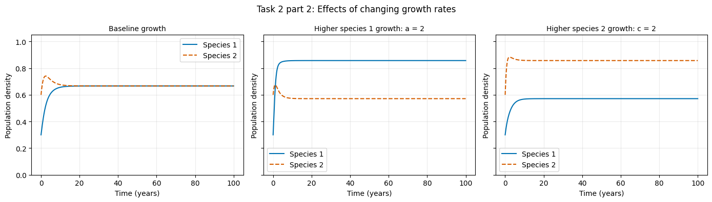
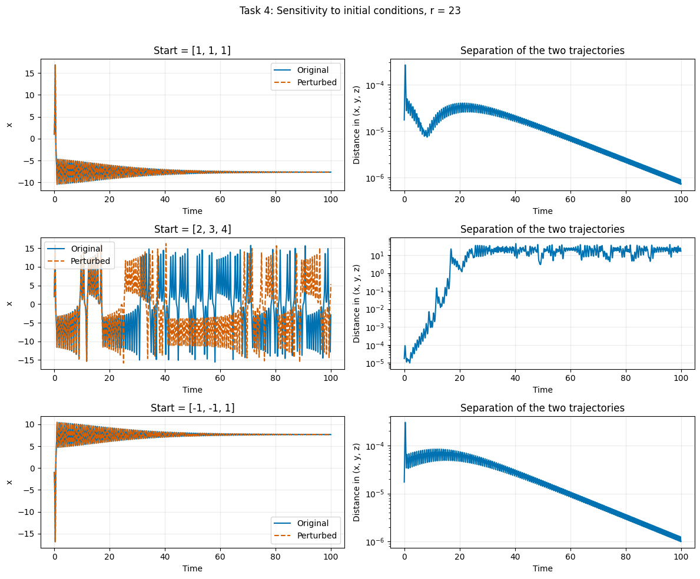
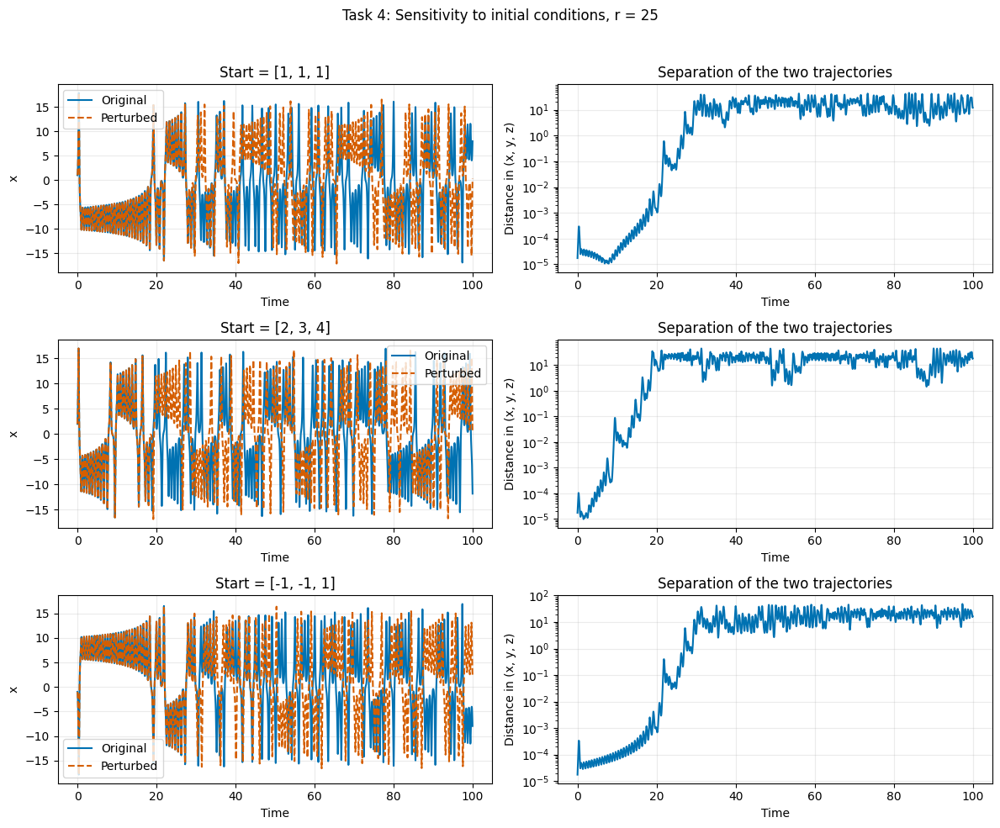

# Lab 2: Lotka-Volterra Population Dynamics
## Keira Slocum, Climate 410

Today I learned I can add pngs to markdown files 🥳🎊 (yayyyayaya)

### Task 1:
**How does the performance of the Euler method solver compare to the rk45 method for both sets of equations? **

For both examples, I used a=1, b=2, c=1, d=3, and initial populations N_1=0.3, N_2=0.6 for 100 years. The code plots Euler and RK45 trajectories together and prints their final populations and endpoint differences. It also repeats Euler with half the time step to show the effect of step size.

For the competition model, the starting rates are dN_1/dt=-0.15 and dN_2/dt=-0.30. The nonzero equilibrium is N_1=0.2, N_2=0.4, and these initial conditions lie on the line N_2=2N_1. Both methods approach this equilibrium for this particular example. The one-year Euler step is relatively coarse, but it does a good job showing the euler step. On the other hand, the RK45 result appears to be a more accurate reference model.

For the predator-prey model, the equilibrium is prey c/d=1/3 and predator a/b=0.5. From the chosen initial populations, both initial rates are -0.06, so both populations initially decrease. The populations then oscillate around the equilibrium. Euler with a 0.05 step approximates the oscillation, but its error builds up and can distort the cycle. RK45 tracks the oscillation more accurately. Reducing Euler's step to 0.025 years should bring its endpoint closer to RK45, but step count increases and the code takes longer to run.

This comparison depends on the chosen conditions: the competition example follows a special path toward its equilibrium, while the repeating predator-prey cycle makes accumulated time-stepping error easier to see

### Figure 1: Competition Model and timestep

### Task 2:
For the competition models: How do the initial conditions and coefficient values affect the final result and general behavior of the two species? 

Initial conditions and competition coefficients affect both the populations’ behavior over time and whether they coexist or one approaches extinction. Under strong competition, initial conditions
can determine which species survives: in the figure’s left column, reversing the starting densities reverses which curve approaches 1 and which approaches zero. Under weaker competition, initial conditions affect the early behavior but not the final outcome. Both curves in the middle column approach approximately 0.67, demonstrating coexistence despite different starting populations.Differing competition strengths can also overpower an initial population advantage. In the right column, species 2 strongly suppresses species 1 but experiences weaker competition itself. Its dashed orange curve approaches 1 in both rows, even when it starts smaller, while the blue curve approaches zero. 

Figure 2 also shows that initial conditions influence the populations’ behavior before equilibrium. In the middle subplots, the initiallylarger population briefly overshoots its final density before both species settle near 0.67. Increasing either growth coefficients strengthens that species’ growth relative to competition and can change the coexistence densities or survival
outcome. 

### Figure 2: Initial Population and Competition Stregth

Figure 3 shows that variance in growth coefficients affects the final population densities. With both constants equal to 1, both species approach 0.67 as we discovered previously. If we increase species 1's growth coefficient by doubling it (middle Figure 3 subplot) we get a density of about .86, and species 2 which maintains the same growth constant's density decreases to about 0.57. If we instead increase species 2's coefficient (c=2), then the associated densties switch populations. Therefore, a higher growth constant which represents quicker reproduction whem viewed in isolation indicates that the species with faster reproduction affects the one without by supressing the other's growth. 
### Figure 3: Growth Coefficient Impacts

### Task 3: 
**For the Predator-Prey models: How do the initial conditions and coefficient values affect the final result and general behavior of the two species? What new information can we get from the phase diagrams?**

Initial conditions and coefficients affect the population ranges, cycle lengths, and equilibrium densities of the predator-prey model. Figure 4 shows recurring oscillations in every experiment. In the left panels, blue prey peaks occur before dashed orange predator peaks: abundant prey support predator growth, predators reduce prey, and declining food availability then reduces predators.

In the first row, the baseline prey density varies from approximately 0.27 to 0.41, while predator density varies from 0.40 to 0.62. The small closed loop in the right panel surrounds the equilibrium at \((0.33,0.50)\), showing repeated cycles rather than convergence to constant populations.

In the second row, changing the initial populations from \((0.3,0.6)\) to \((0.6,0.3)\) increases the population swings. Prey range from approximately 0.13 to 0.68, and predators range from 0.20 to 1.02. The phase loop becomes larger, but the equilibrium stays at \((0.33,0.50)\). Initial conditions therefore change the trajectory and population extremes without changing equilibrium.

In the third row, increasing prey growth \(a\) from 1 to 2 produces faster cycles and raises predator peaks to approximately 1.55. The phase loop extends upward, and equilibrium predator density rises from 0.50 to 1.00. Faster prey reproduction supports more predators, while equilibrium prey density remains 0.33.

In the fourth row, increasing predation strength \(b\) from 2 to 3 lowers equilibrium predator density from 0.50 to 0.33. The phase loop extends farther horizontally than the baseline, with prey varying from approximately 0.16 to 0.60. Stronger predation initially reduces prey, but subsequent predator declines allow prey to recover; it does not keep prey lower throughout the cycle.

In the fifth row, increasing predator death \(c\) from 1 to 2 produces larger, faster oscillations. Predator declines allow prey to reach approximately 1.26, followed by predator peaks near 1.19. The phase loop stretches rightward, and equilibrium prey density increases from 0.33 to 0.67 because more prey are needed to offset predator deaths. Densities above 1 are possible because this model has no carrying-capacity limit.

In the sixth row, increasing predator growth \(d\) from 3 to 4 lowers prey densities to approximately 0.19–0.32. The phase loop shifts left, and equilibrium prey density falls to 0.25 because predators can sustain themselves with fewer prey. Equilibrium predator density remains 0.50.

The phase diagrams show that all six experiments follow regular closed cycles, with no visible convergence toward equilibrium or expanding spiral. They make changes in population extremes and equilibrium location easier to distinguish: initial conditions change the loop, while coefficients can also move its equilibrium point. The time plots additionally reveal cycle lengths and the delay between prey and predator peaks. Thus, the populations at 30 years are points within continuing cycles rather than final steady values.

### Task 4:
What does this tell us about the feasibility of performing long-term weather forecasts or making long-term predictions about any non-linear system?

The Lorenz experiments show that a small change in initial conditions can lead to large differences later, depending on the model parameters and starting point. Figures 5 and 6 compare two runs whose starting values differ by 10^-5 in each of x, y, and z. The left panels show x over time, while the right panels show the distance between the runs using all three variables. The logarithmic scale makes small and large differences visible.

For r=23, Figure 5 shows that the starting point affects the outcome. In the top row, starting near (1,1,1) produces smalelr and smaller oscillations toward approximately 7.7. The blue and orange curves remain nearly identical, and their separation falls below 10^-6 by time 100. In the bottom row, starting near (-1,-1,1) gives similar behavior, but x approaches approximately 7.7. The small initial differences shrink as both runs approach the same equilibrium.

The middle row of Figure 5 behaves differently. Starting near (2,3,4) produces irregular oscillations between positive and negative values of x. The two runs eventually switch at different times, and their separation grows from approximately 10^-5 to order 10 by about time 20. It stays large through time 100. This shows strong sensitivity during the simulation, although the figure cannot establish whether that behavior continues indefinitely.

For r=25, Figure 6 shows large differences for all three starting points. In the top row, the runs starting near (1,1,1) separate substantially by about time 30. In the middle row, the runs starting near (2,3,4) separate by about time 20. In the bottom row, the runs starting near (-1,-1,1) separate around time 25–30. All three left panels show continuing irregular oscillations, with the original and perturbed runs increasingly disagreeing about when x becomes positive or negative.

After the trajectories separate, their distance fluctuates rather than growing indefinitely. Both runs remain within a limited range, but they predict different states at the same time. A temporary decrease in distance does not mean they have permanently returned to agreement.

These results show why accurate long-term weather forecasts can be difficult. The small uncertainties in starting conditions can grow into large errors. However, not every nonlinear system behaves this way. The shrinking differences in two r=23 experiments show that some trajectories approach stable states. Long-term predictability therefore depends on the parameters and timespan.

