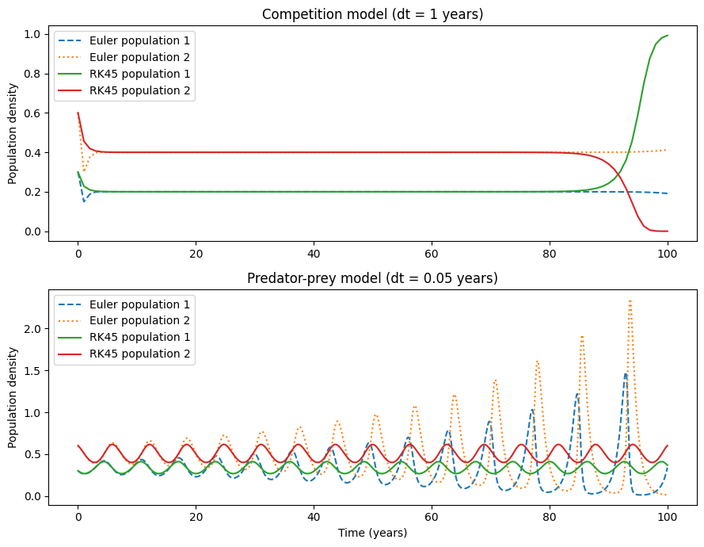
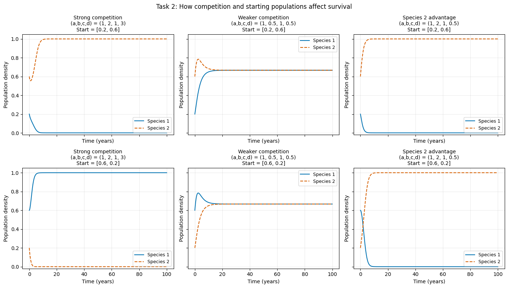
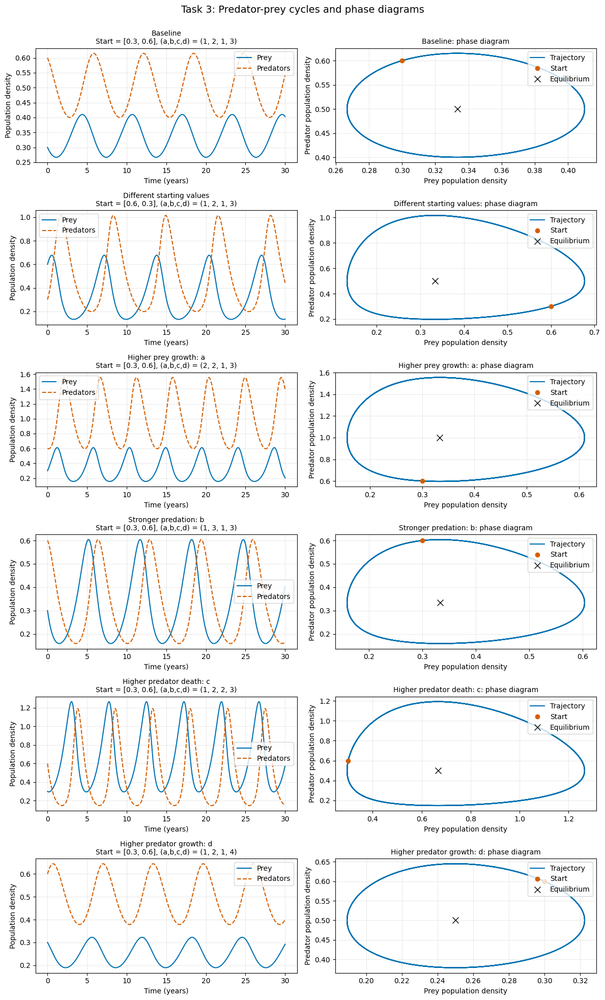

# Lab 2: Lotka-Volterra Population Dynamics
## Keira Slocum, Climate 410

Today I learned I can add pngs to markdown files 🥳🎊 (yayyyayaya)

### Task 1:
**How does the performance of the Euler method solver compare to the rk45 method for both sets of equations? **

For both examples, I used a=1, b=2, c=1, d=3, and initial populations N_1=0.3, N_2=0.6 for 100 years. The code plots Euler and RK45 trajectories together and prints their final populations and endpoint differences. It also repeats Euler with half the time step to show the effect of step size.

For the competition model, the starting rates are dN_1/dt=-0.15 and dN_2/dt=-0.30. The nonzero equilibrium is N_1=0.2, N_2=0.4, and these initial conditions lie on the line N_2=2N_1. Both methods approach this equilibrium for this particular example. The one-year Euler step is relatively coarse, but it does a good job showing the euler step. On the other hand, the RK45 result appears to be a more accurate reference model.

For the predator-prey model, the equilibrium is prey c/d=1/3 and predator a/b=0.5. From the chosen initial populations, both initial rates are -0.06, so both populations initially decrease. The populations then oscillate around the equilibrium. Euler with a 0.05 step approximates the oscillation, but its error builds up and can distort the cycle. RK45 tracks the oscillation more accurately. Reducing Euler's step to 0.025 years should bring its endpoint closer to RK45, but step count increases and the code takes longer to run.

This comparison depends on the chosen conditions: the competition example follows a special path toward its equilibrium, while the repeating predator-prey cycle makes accumulated time-stepping error easier to see

### Figure 1: Competition Model and timestep

### Task 2:
For the competition models: How do the initial conditions and coefficient values affect the final result and general behavior of the two species? SHOW EXAMPLES

### Task 3: 
**For the Predator-Prey models: How do the initial conditions and coefficient values affect the final result and general behavior of the two species? What new information can we get from the phase diagrams?**

### Task 4:
What does this tell us about the feasibility of performing long-term weather forecasts or making long-term predictions about any non-linear system?

